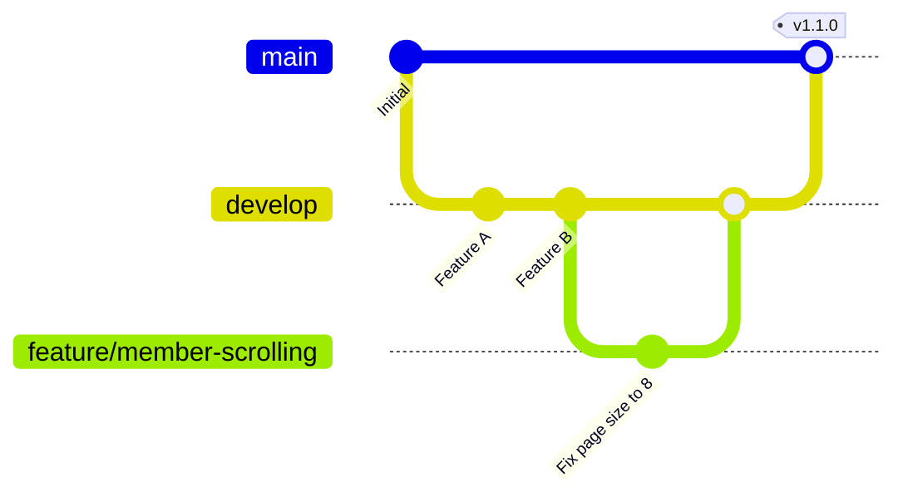

# LifeGuardian CI/CD 자동화 계획서

본 문서는 LifeGuardian 프로젝트(Spring Boot 백엔드 및 Vue 3 프론트엔드)의 지속적 통합(CI) 및 지속적 배포(CD) 파이프라인 자동화 계획서입니다. GitHub Actions를 중심으로 안정적인 빌드, 테스트 검증 및 배포 전략을 수립합니다.

---

## 1. 프로젝트 아키텍처 개요

* **Backend**: Java 21, Spring Boot, Maven
* **Frontend**: Node.js, Vue 3, TypeScript, Vite, npm
* **CI/CD 플랫폼**: GitHub Actions
* **배포 인프라**: AWS (S3, CloudFront, EC2/ECS)

---

## 2. 브랜치 전략 (Git Flow 기반)



* **`main`**: 상용(Production) 배포용 브랜치. 태그(`v*.*.*`) 생성 시 운영 서버 배포 실행.
* **`develop`**: 개발(Staging) 통합 브랜치. 기능 구현 완료 시 머지되어 스테이징 배포 실행.
* **`feature/*`**: 기능 단위 개발 브랜치. `develop` 브랜치로 Pull Request(PR) 요청 시 CI 검증 파이프라인 작동.

---

## 3. CI (지속적 통합) 파이프라인 계획

모든 PR 및 커밋 시 코드 품질과 빌드 안정성을 확보하기 위해 프론트엔드와 백엔드 빌드를 분할 및 병렬 검증합니다.

```
[GitHub PR 생성] 
       │
       ├───► [Frontend CI] ──► Lint 검사 ──► 타입 체킹 ──► Vite 빌드
       │
       └───► [Backend CI] ───► JDK 21 설정 ──► Maven 컴파일 ──► JUnit 테스트 실행
```

### 3.1. Frontend CI Workflow (`.github/workflows/frontend-ci.yml`)
* **실행 시점**: `develop`, `main` 브랜치 대상 Pull Request 오픈 시
* **주요 단계**:
  1. **코드 체크아웃**: `actions/checkout@v4`
  2. **Node.js 개발 환경 구성**: Node.js 20.x 세팅 및 npm 의존성 캐싱 (`actions/setup-node@v4`)
  3. **의존성 설치**: `npm ci` 실행
  4. **Lint 및 스타일 검사**: `npm run lint`로 코드 품질 검사
  5. **TypeScript 빌드 검증**: `npm run type-check`로 컴파일 타입 검사
  6. **테스트 빌드**: `npm run build`를 실행하여 Webpack/Vite 번들링 검증

### 3.2. Backend CI Workflow (`.github/workflows/backend-ci.yml`)
* **실행 시점**: `develop`, `main` 브랜치 대상 Pull Request 오픈 시
* **주요 단계**:
  1. **코드 체크아웃**: `actions/checkout@v4`
  2. **JDK 21 세팅**: Eclipse Temurin 배포판 JDK 21 환경 구성 (`actions/setup-java@v4`)
  3. **Maven 의존성 캐싱**: 빌드 속도 단축을 위해 `~/.m2` 라이브러리 캐싱 적용
  4. **Maven 컴파일**: `mvn clean compile`을 실행하여 소스코드 이상 유무 확인
  5. **단위 테스트 실행**: `mvn test`를 통한 JUnit 테스트 커버리지 검증

---

## 4. CD (지속적 배포) 파이프라인 계획

코드 품질 검증이 완료된 코드를 머지 시 개발 및 상용 인프라에 무중단 자동 배포합니다.

### 4.1. Frontend CD 플로우 (AWS S3 + CloudFront)
1. **빌드 아티팩트 생성**: `npm run build`를 수행해 최적화된 정적 자산(CSS, JS, HTML) 빌드.
2. **S3 동기화**: `aws s3 sync` 명령어를 통해 정적 빌드 폴더(`dist`)를 AWS S3 버킷에 배포.
3. **CloudFront 캐시 무효화**: 사용자가 최신 빌드 리소스를 즉각 확인할 수 있도록 `aws cloudfront create-invalidation`을 수행해 Edge 캐시 무효화 적용.

### 4.2. Backend CD 플로우 (AWS EC2 / ECS 무중단 배포)
1. **패키징**: Maven `mvn clean package -DskipTests`를 통해 단일 실행 가능한 JAR 파일 생성.
2. **도커 이미지 빌드 및 푸시**: Dockerfile을 이용해 가벼운 JRE 실행 환경 이미지를 빌드한 뒤 AWS ECR에 푸시.
3. **무중단 배포 (Blue-Green / Rolling)**:
   - AWS ECS를 사용하는 경우: Task Definition을 업데이트하여 점진적으로 인스턴스를 교체하는 롤링 업데이트 수행.
   - 단일 EC2를 사용하는 경우: Nginx 리버스 프록시와 Spring Boot의 가용 포트 스위칭 구조(Port 8080/8081)를 사용하여 무중단 무동작 스위칭 쉘스크립트 자동화 구동.

---

## 5. 보안 및 비밀키(Secrets) 관리 전략

빌드 및 배포 파이프라인에 사용되는 비밀값들은 하드코딩하지 않고 GitHub Repository Secrets로 보호합니다.
* **`AWS_ACCESS_KEY_ID` / `AWS_SECRET_ACCESS_KEY`**: AWS 서비스 접근 자격증명
* **`DB_PASSWORD` / `JWT_SECRET`**: 백엔드 빌드 및 통합 테스트 진행 시 환경변수 주입
* **`SLACK_WEBHOOK_URL`**: CI/CD 실패/성공 여부 알림 전송용 채널 연계

---

## 6. 품질 목표 및 게이트웨이(Quality Gate)

1. **테스트 패스율 100%**: `mvn test` 실행 결과 실패 사례가 단 1건이라도 존재할 시 머지 금지 및 빌드 차단.
2. **컴파일 에러 제로**: 빌드 중 컴파일 오류나 타입 에러 발생 시 자동 롤백 및 알림.
3. **코드 소유자 리뷰**: 배지 색상 수정, 주요 연월 및 페이징 레이아웃 변화처럼 주요 프론트/백엔드 로직 수정이 포함될 경우, 지정된 코드 오너(`CODEOWNERS`)의 최소 1인 이상 승인 필수 적용.
