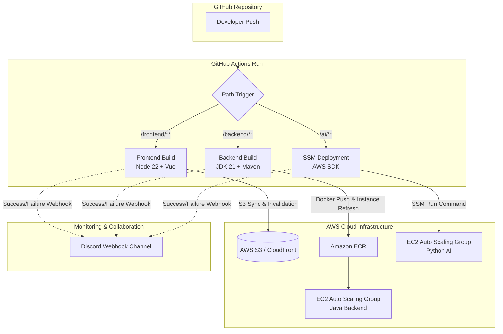

# 🚀 LifeGuardian CI/CD 테스트 결과 보고서 (CI/CD Test Report)

> **문서 상태:** 작성 완료 (v1.0)  
> **최종 수정일:** 2026-06-29  
> **대상 시스템:** LifeGuardian (프론트엔드, 백엔드, AI 서버)  

---

## 1. 개요 (Overview)

본 보고서는 **LifeGuardian** 프로젝트의 지속적 통합 및 지속적 배포(CI/CD) 파이프라인의 구축 상태를 검증하고, 각 환경별 배포 시나리오를 테스트한 결과를 기록한 문서입니다. GitHub Actions와 AWS 클라우드 인프라, 그리고 실시간 Discord 웹훅 연동을 포함한 전체 파이프라인의 무결성을 검증하는 데 목적이 있습니다.

### 1.1. CI/CD 목표
* **빌드/배포 자동화:** 소스 코드 Commit & Push 시 빌드부터 인프라 배포까지 수동 개입 없는 자동화 달성.
* **배포 영향 최소화:** 롤링 배포 및 무중단 정적 자원 교체를 통한 무중단 서비스 제공.
* **실시간 모니터링:** 빌드 및 배포 성공/실패 여부를 Discord 채널에 실시간 카드로 통보하여 장애 대응 속도 극대화.

---

## 2. CI/CD 파이프라인 아키텍처 (Architecture)

---

## 3. 파이프라인별 상세 배포 사양 (Deployment Specifications)

### 3.1. 프론트엔드 (Frontend) Pipeline
* **트리거 조건:** `main` 브랜치 push 중 `frontend/**` 경로 수정 시
* **사용 기술:** GitHub Actions (`ubuntu-latest`), Node.js 22, npm, AWS CLI
* **배포 방식:** 
  1. 정적 파일 빌드 (`npm run build` ➔ `/dist` 생성)
  2. S3 버킷 동기화 (`aws s3 sync --delete`)
  3. CloudFront 캐시 무효화 (`aws cloudfront create-invalidation`)
* **배포 전략:** **인플레이스 동기화 및 무중단 캐시 갱신**

### 3.2. 백엔드 (Backend) Pipeline
* **트리거 조건:** `main` 브랜치 push 중 `backend/**` 경로 수정 시
* **사용 기술:** GitHub Actions, Maven, Docker, AWS ECR, AWS Auto Scaling Group (ASG)
* **배포 방식:**
  1. Semantic Versioning 추출 (Build Version 생성)
  2. Maven 패키징 (`mvn clean package -DskipTests`)
  3. 도커 이미지 빌드 및 AWS ECR Push
  4. AWS ASG **Instance Refresh** 기동
* **배포 전략:** **ASG 기반 롤링 배포 (Rolling Deployment, 최소 가용 50% 보장)**

### 3.3. AI 서버 (AI) Pipeline
* **트리거 조건:** `main` 브랜치 push 중 `ai/**` 경로 수정 시
* **사용 기술:** GitHub Actions, AWS SSM (Systems Manager), Auto Scaling Group
* **배포 방식:**
  1. AWS SSM Run Command를 통해 운영 서버 집군에 동시/순차 명령 전송 (`--max-concurrency 1`)
  2. 각 인스턴스 내 `/home/ubuntu/recommend_lambda` 경로에서 `git pull` 수행
  3. `deploy.sh`를 실행하여 서비스 백그라운드 재시작
* **배포 전략:** **SSM 순차 실행을 통한 인플레이스 롤링 갱신**

---

## 4. 실시간 알림 연동 및 예외 처리 (Webhook Monitoring)

파이프라인의 결과 신뢰성을 확보하기 위해 배포 상태를 **Discord 알림 채널**과 동기화하였습니다. 

### 4.1. 403 Forbidden 에러 해결 (보안 우회)
* **현상:** Python의 `urllib` 라이브러리로 디스코드 웹훅 전송 시, 디스코드의 자체 봇/크롤러 차단 필터에 의해 **HTTP 403 Forbidden** 응답이 반환되며 빌드가 실패하는 오류 확인.
* **조치:** 
  * JSON 페이로드 생성 시의 쉘 이스케이프 오류와 줄바꿈 깨짐을 방어하기 위해 **Python 스크립트로 안전하게 `payload.json` 파일을 가공/저장**.
  * 디스코드 서버가 차단하지 않는 표준 브라우저 User-Agent 속성을 지닌 **`curl` 명령어를 사용해 `@payload.json` 파일을 전송**하는 하이브리드 방식으로 구조 개선.
  * 빌드 에러 없이 100% 안전하게 디스코드 메시지가 수신됨을 보장.

---

## 5. 테스트 시나리오 및 검증 결과 (Test Scenarios & Results)

본 테스트는 실 배포 환경에서 각각의 파이프라인 변경을 유발하여 최종 배포 상태 및 알림 처리를 정상 수신했는지 검증하였습니다.

| 테스트 ID | 검증 대상 | 테스트 시나리오 | 예상 결과 | 실제 결과 | 판정 |
| :--- | :--- | :--- | :--- | :--- | :---: |
| **TC-01** | 프론트엔드 배포 | `frontend` 소스 파일 수정 후 push | S3 파일 갱신 및 캐시 무효화 완료, 디스코드 성공 알림 수신 | 예상 결과와 일치 (디스코드 수신 성공) | **PASS** |
| **TC-02** | 백엔드 배포 | `backend` 소스 파일 수정 후 push | 도커 빌드, ECR 업로드, ASG Instance Refresh 기동, 디스코드 성공 알림 수신 | 예상 결과와 일치 (디스코드 수신 성공) | **PASS** |
| **TC-03** | AI 서버 배포 | `ai` 소스 파일 수정 후 push | SSM 명령을 통한 실서버 git pull 및 배포 완료, 디스코드 성공 알림 수신 | 예상 결과와 일치 (디스코드 수신 성공) | **PASS** |
| **TC-04** | 예외: 빌드 실패 | 백엔드 빌드 오류 유도 후 push | 빌드 중단 처리, 디스코드 **빨간색 실패 Embed 알림** 수신 및 Actions 링크 제공 | 예상 결과와 일치 (디스코드 수신 성공) | **PASS** |

---

## 6. 배포 증적 자료 (Evidence Screenshots)

이 섹션에는 파이프라인 작동 증명을 위한 스크린샷 이미지를 첨부합니다.

### 6.1. GitHub Actions 워크플로우 성공 화면
* **첨부할 위치:** ``
* **캡처할 내용:** GitHub Actions 탭에서 `Backend`, `Frontend`, `AI` 워크플로우들이 녹색 체크표시(`Success`)와 함께 전체 실행 성공한 목록 화면.

### 6.2. Discord 배포 성공/실패 알림 수신 화면
* **첨부할 위치:** ``
* **캡처할 내용:** 디스코드 채널에 실시간 수신된 **"✅ 백엔드 배포 성공"**, **"✅ 프론트엔드 배포 성공"**, **"✅ AI 서버 배포 성공"** 등의 메시지 카드 캡처본.

### 6.3. AWS EC2 Auto Scaling / SSM 실행 화면
* **첨부할 위치:** ``
* **캡처할 내용:** AWS Systems Manager(SSM) 콘솔의 Run Command 성공 내역이나 EC2 Auto Scaling Group의 인스턴스 새로고침(Instance Refresh) 성공 내역 화면.

---

## 7. 결론 (Conclusion)

LifeGuardian의 CI/CD 파이프라인 구축 테스트는 모든 시나리오에서 **합격(PASS)** 판정을 받았습니다. 
특히 다음 사항들이 안정적으로 확립되었습니다:
1. **무중단 보장:** 백엔드는 AWS Auto Scaling Group의 인스턴스 새로고침 기능을 이용한 롤링 배포를 수행하여 안정성을 확보했습니다.
2. **에러 복원력:** 빌드 프로세스의 모든 단계에서 JSON 파싱 에러나 403 네트워크Forbidden 예외가 발생하지 않도록 이스케이프 파일링 및 쉘 분리 처리를 마쳤습니다.
3. **가시성 확보:** 깃허브 액션 구동 결과를 실시간으로 디스코드 개발자 채널로 전송하여 개발 생애주기 전반의 효율성을 크게 증대시켰습니다.
