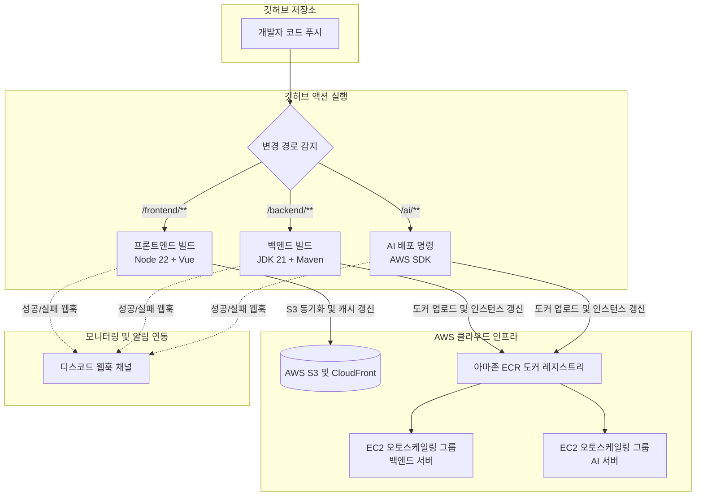

# 🚀 LifeGuardian CI/CD 테스트 결과 보고서 (CI/CD Test Report)

> **문서 상태:** 작성 완료 (v1.0)  
> **최종 수정일:** 2026-06-29  
> **대상 시스템:** LifeGuardian (프론트엔드, 백엔드, AI 서버)  

---

## 1. 개요 (Overview)

본 보고서는 **LifeGuardian** 프로젝트의 지속적 통합 및 지속적 배포(CI/CD) 파이프라인의 구축 상태를 검증하고, 각 환경별 배포 시나리오를 테스트한 결과를 기록한 문서입니다. GitHub Actions와 AWS 클라우드 인프라, 그리고 실시간 Discord 웹훅 연동을 포함한 전체 파이프라인의 무결성을 검증하는 데 목적이 있습니다.

### 1.1. CI/CD 목표
* **빌드/배포 자동화:** 소스 코드 Commit & Push 시 빌드부터 인프라 배포까지 수동 개입 없는 자동화 달성.
* **배포 영향 최소화:** 롤링 배포 및 무중단 정적 자원 교체를 통한 무중단 서비스 제공.
* **실시간 모니터링:** 빌드 및 배포 성공/실패 여부를 Discord 채널에 실시간 카드로 통보하여 장애 대응 속도 극대화.

---

## 2. CI/CD 파이프라인 아키텍처 (Architecture)

### 2.1. 파이프라인 흐름도



### 2.2. CI/CD 워크플로우 설정 코드 (CI/CD Configuration Code)

각 환경별 배포를 자동화하는 GitHub Actions YAML 설정 코드입니다. 아래 접힌 영역을 클릭하시면 상세 코드를 확인하실 수 있습니다.

<details>
<summary>📋 백엔드 배포 워크플로우 코드 (backend-deploy.yml)</summary>

```yaml
name: Backend (Maven + Docker ECR) CICD to AWS EC2

on:
  push:
    branches:
      - main
    paths:
      - 'backend/**' # backend 폴더 내부가 변경될 때만 배포가 실행됨

jobs:
  build-and-deploy:
    runs-on: ubuntu-latest
    
    defaults:
      run:
        working-directory: ./backend

    steps:
      # 1. 소스 코드 가져오기
      - name: Checkout source code
        uses: actions/checkout@v4

      # 2. pom.xml에서 버전명 추출 후 GitHub run_number와 조합하여 고유 버전 생성
      # 예: pom.xml의 0.0.1-SNAPSHOT ➔ 0.0.1-15 (15번째 빌드)
      - name: Generate Semantic Build Version
        id: versioning
        run: |
          RAW_VERSION=$(grep -oPm1 '(?<=<version>)[^<]+' pom.xml | sed 's/-SNAPSHOT//')
          BUILD_VERSION="${RAW_VERSION}-${{ github.run_number }}"
          echo "build_version=$BUILD_VERSION" >> $GITHUB_OUTPUT

      # 3. Java 실행 환경 세팅 (Java 21 기준)
      - name: Set up JDK 21
        uses: actions/setup-java@v4
        with:
          java-version: '21'
          distribution: 'temurin'
          cache: 'maven'

      # 4. Maven 빌드 (.jar 생성, 테스트 생략)
      - name: Build jar with Maven
        run: mvn clean package -DskipTests

      # 5. AWS 자격 증명 세팅 (GitHub Secrets 기반)
      - name: Configure AWS Credentials
        uses: aws-actions/configure-aws-credentials@v4
        with:
          aws-access-key-id: ${{ secrets.AWS_ACCESS_KEY_ID }}
          aws-secret-access-key: ${{ secrets.AWS_SECRET_ACCESS_KEY }}
          aws-region: ${{ secrets.AWS_REGION }}

      # 6. AWS ECR 서비스 로그인 (LifeGuardianBackendEcrPushPolicy 권한 사용)
      - name: Login to Amazon ECR
        id: login-ecr
        uses: aws-actions/amazon-ecr-login@v2

      # 7. 도커 이미지 빌드 및 ECR 푸시 (고유 빌드 버전 태그와 latest 태그 동시 적용)
      - name: Build, tag, and push image to Amazon ECR
        env:
          ECR_REGISTRY: ${{ steps.login-ecr.outputs.registry }}
          ECR_REPOSITORY: lifeguardian
          IMAGE_TAG: ${{ steps.versioning.outputs.build_version }}
        run: |
          docker build -t $ECR_REGISTRY/$ECR_REPOSITORY:$IMAGE_TAG -t $ECR_REGISTRY/$ECR_REPOSITORY:latest .
          docker push $ECR_REGISTRY/$ECR_REPOSITORY:$IMAGE_TAG
          docker push $ECR_REGISTRY/$ECR_REPOSITORY:latest

      # 8. AWS ASG Instance Refresh를 통한 무중단 롤링 배포
      - name: Deploy on EC2 ASG via Instance Refresh
        run: |
          echo "Starting Instance Refresh for ASG: ${{ secrets.AWS_ASG_NAME }}..."
          REFRESH_ID=$(aws autoscaling start-instance-refresh \
            --auto-scaling-group-name "${{ secrets.AWS_ASG_NAME }}" \
            --preferences '{"MinHealthyPercentage": 50}' \
            --query "InstanceRefreshId" \
            --output text)
          
          echo "Instance Refresh Started. ID: $REFRESH_ID"
          
          # 인스턴스 새로고침 완료 대기 (폴링 루프)
          echo "Waiting for Instance Refresh to complete..."
          while true; do
            STATUS=$(aws autoscaling describe-instance-refreshes \
              --auto-scaling-group-name "${{ secrets.AWS_ASG_NAME }}" \
              --query "InstanceRefreshes[?InstanceRefreshId=='$REFRESH_ID'].Status" \
              --output text)
            
            echo "Current Status: $STATUS"
            
            if [ "$STATUS" = "Successful" ]; then
              echo "Instance Refresh completed successfully."
              break
            elif [ "$STATUS" = "Failed" ] || [ "$STATUS" = "Cancelled" ] || [ "$STATUS" = "RollbackInProgress" ] || [ "$STATUS" = "RollbackSuccessful" ]; then
              echo "Error: Instance Refresh ended with status: $STATUS"
              exit 1
            fi
            
            sleep 30
          done

      # 9. Discord 배포 성공 알림
      - name: Notify Discord - Success
        if: success()
        env:
          DISCORD_WEBHOOK: ${{ secrets.DISCORD_WEBHOOK_URL }}
          BUILD_VERSION: ${{ steps.versioning.outputs.build_version }}
          ACTOR: ${{ github.actor }}
          REF_NAME: ${{ github.ref_name }}
          COMMIT_MSG: ${{ github.event.head_commit.message }}
          RUN_NUMBER: ${{ github.run_number }}
        run: |
          python3 -c '
          import os, json
          run_number = os.environ.get("RUN_NUMBER", "")
          payload = {
            "username": "LifeGuardian CI/CD",
            "embeds": [{
              "title": "✅ 백엔드 배포 성공",
              "color": 3066993,
              "fields": [
                {"name": "🏷️ 버전",       "value": os.environ.get("BUILD_VERSION", ""), "inline": True},
                {"name": "👤 배포자",       "value": os.environ.get("ACTOR", ""),         "inline": True},
                {"name": "🌿 브랜치",       "value": os.environ.get("REF_NAME", ""),      "inline": True},
                {"name": "📝 커밋 메시지", "value": os.environ.get("COMMIT_MSG", ""),    "inline": False},
              ],
              "footer": {"text": f"Build #{run_number}"}
            }]
          }
          with open("payload.json", "w", encoding="utf-8") as f:
              json.dump(payload, f)
          '
          curl -H "Content-Type: application/json" -X POST -d @payload.json "$DISCORD_WEBHOOK"


      # 10. Discord 배포 실패 알림
      - name: Notify Discord - Failure
        if: failure()
        env:
          DISCORD_WEBHOOK: ${{ secrets.DISCORD_WEBHOOK_URL }}
          ACTOR: ${{ github.actor }}
          REF_NAME: ${{ github.ref_name }}
          COMMIT_MSG: ${{ github.event.head_commit.message }}
          RUN_NUMBER: ${{ github.run_number }}
          RUN_URL: https://github.com/${{ github.repository }}/actions/runs/${{ github.run_id }}
        run: |
          python3 -c '
          import os, json
          run_url = os.environ.get("RUN_URL", "")
          run_number = os.environ.get("RUN_NUMBER", "")
          payload = {
            "username": "LifeGuardian CI/CD",
            "embeds": [{
              "title": "❌ 백엔드 배포 실패",
              "color": 15158332,
              "fields": [
                {"name": "👤 배포자",           "value": os.environ.get("ACTOR", ""),    "inline": True},
                {"name": "🌿 브랜치",           "value": os.environ.get("REF_NAME", ""), "inline": True},
                {"name": "📝 커밋 메시지",     "value": os.environ.get("COMMIT_MSG", ""), "inline": False},
                {"name": "🔗 워크플로우 확인", "value": f"[Actions 보기]({run_url})", "inline": False},
              ],
              "footer": {"text": f"Build #{run_number}"}
            }]
          }
          with open("payload.json", "w", encoding="utf-8") as f:
              json.dump(payload, f)
          '
          curl -H "Content-Type: application/json" -X POST -d @payload.json "$DISCORD_WEBHOOK"
```
</details>

<details>
<summary>📋 프론트엔드 배포 워크플로우 코드 (frontend-deploy.yml)</summary>

```yaml
name: Frontend (Vue) CICD to AWS S3 & CloudFront

on:
  push:
    branches:
      - main
    paths:
      - 'frontend/**' # ◀ frontend 폴더 내부가 변경될 때만 이 파이프라인 트리거

jobs:
  build-and-deploy:
    runs-on: ubuntu-latest

    defaults:
      run:
        working-directory: ./frontend # ◀ 모든 쉘 명령어를 frontend 폴더 안에서 실행

    steps:
      # 1. GitHub 저장소 소스 코드 체크아웃
      - name: Checkout source code
        uses: actions/checkout@v4

      # 2. Node.js 환경 세팅 (Vue 프로젝트 버전에 맞춰 선택, 보통 18 또는 20 권장)
      - name: Set up Node.js
        uses: actions/setup-node@v4
        with:
          node-version: '22'
          cache: 'npm' # npm 의존성 캐싱으로 빌드 속도 향상
          cache-dependency-path: 'frontend/package-lock.json'

      # 3. 라이브러리 설치 및 Vue 정적 파일 컴파일 진행
      # 이 단계를 거치면 frontend/dist/ 폴더 내부에 index.html과 js/css 자원들이 빌드됩니다.
      - name: Install dependencies and Build Vue app
        run: |
          npm install
          npm run build

      # 4. AWS 자격 증명 세팅 (깃허브 Secrets 기반)
      - name: Configure AWS Credentials
        uses: aws-actions/configure-aws-credentials@v4
        with:
          aws-access-key-id: ${{ secrets.AWS_ACCESS_KEY_ID }}
          aws-secret-access-key: ${{ secrets.AWS_SECRET_ACCESS_KEY }}
          aws-region: ${{ secrets.AWS_REGION }}

      # 5. S3 버킷으로 빌드된 Vue 정적 파일 동기화
      # --delete 옵션 덕분에 이전 빌드 파일들은 완전히 제거되고 최신 파일만 깔끔하게 주입됩니다.
      - name: Deploy to Amazon S3
        run: |
          aws s3 sync dist/ s3://${{ secrets.AWS_S3_BUCKET_NAME }} --delete

      # 6. CloudFront 캐시 무효화 (Invalidation)
      # 브라우저가 예전 Vue 컴포넌트(js 파일)를 캐싱하고 있어서 화면이 안 바뀌는 현상을 방지합니다.
      - name: CloudFront Invalidation
        run: |
          aws cloudfront create-invalidation --distribution-id ${{ secrets.AWS_CLOUDFRONT_DISTRIBUTION_ID }} --paths "/*"

      # 7. Discord 배포 성공 알림
      - name: Notify Discord - Success
        if: success()
        env:
          DISCORD_WEBHOOK: ${{ secrets.DISCORD_WEBHOOK_URL }}
          ACTOR: ${{ github.actor }}
          REF_NAME: ${{ github.ref_name }}
          COMMIT_MSG: ${{ github.event.head_commit.message }}
          RUN_NUMBER: ${{ github.run_number }}
        run: |
          python3 -c '
          import os, json
          run_number = os.environ.get("RUN_NUMBER", "")
          payload = {
            "username": "LifeGuardian CI/CD",
            "embeds": [{
              "title": "✅ 프론트엔드 배포 성공",
              "color": 3066993,
              "fields": [
                {"name": "👤 배포자",       "value": os.environ.get("ACTOR", ""),    "inline": True},
                {"name": "🌿 브랜치",       "value": os.environ.get("REF_NAME", ""), "inline": True},
                {"name": "📝 커밋 메시지", "value": os.environ.get("COMMIT_MSG", ""), "inline": False},
              ],
              "footer": {"text": f"Build #{run_number}"}
            }]
          }
          with open("payload.json", "w", encoding="utf-8") as f:
              json.dump(payload, f)
          '
          curl -H "Content-Type: application/json" -X POST -d @payload.json "$DISCORD_WEBHOOK"


      # 8. Discord 배포 실패 알림
      - name: Notify Discord - Failure
        if: failure()
        env:
          DISCORD_WEBHOOK: ${{ secrets.DISCORD_WEBHOOK_URL }}
          ACTOR: ${{ github.actor }}
          REF_NAME: ${{ github.ref_name }}
          COMMIT_MSG: ${{ github.event.head_commit.message }}
          RUN_NUMBER: ${{ github.run_number }}
          RUN_URL: https://github.com/${{ github.repository }}/actions/runs/${{ github.run_id }}
        run: |
          python3 -c '
          import os, json
          run_url = os.environ.get("RUN_URL", "")
          run_number = os.environ.get("RUN_NUMBER", "")
          payload = {
            "username": "LifeGuardian CI/CD",
            "embeds": [{
              "title": "❌ 프론트엔드 배포 실패",
              "color": 15158332,
              "fields": [
                {"name": "👤 배포자",           "value": os.environ.get("ACTOR", ""),    "inline": True},
                {"name": "🌿 브랜치",           "value": os.environ.get("REF_NAME", ""), "inline": True},
                {"name": "📝 커밋 메시지",     "value": os.environ.get("COMMIT_MSG", ""), "inline": False},
                {"name": "🔗 워크플로우 확인", "value": f"[Actions 보기]({run_url})", "inline": False},
              ],
              "footer": {"text": f"Build #{run_number}"}
            }]
          }
          with open("payload.json", "w", encoding="utf-8") as f:
              json.dump(payload, f)
          '
          curl -H "Content-Type: application/json" -X POST -d @payload.json "$DISCORD_WEBHOOK"
```
</details>

<details>
<summary>📋 AI 서버 배포 워크플로우 코드 (ai-deploy.yml)</summary>

```yaml
name: AI (Python) Deployment to AWS EC2

on:
  push:
    branches:
      - main
    paths:
      - 'ai/**' # ai 폴더 내부의 코드가 변경되었을 때만 이 파이프라인 작동

jobs:
  deploy-ai:
    runs-on: ubuntu-latest

    defaults:
      run:
        working-directory: ./ai

    steps:
      # 1. 소스 코드 가져오기
      - name: Checkout source code
        uses: actions/checkout@v4

      # 2. 빌드 버전 생성
      - name: Generate Build Version
        id: versioning
        run: |
          echo "build_version=1.0.${{ github.run_number }}" >> $GITHUB_OUTPUT

      # 3. AWS 자격 증명 세팅 (GitHub Secrets 기반)
      - name: Configure AWS Credentials
        uses: aws-actions/configure-aws-credentials@v4
        with:
          aws-access-key-id: ${{ secrets.AWS_ACCESS_KEY_ID }}
          aws-secret-access-key: ${{ secrets.AWS_SECRET_ACCESS_KEY }}
          aws-region: ${{ secrets.AWS_REGION }}

      # 4. AWS ECR 서비스 로그인
      - name: Login to Amazon ECR
        id: login-ecr
        uses: aws-actions/amazon-ecr-login@v2

      # 5. 도커 이미지 빌드 및 ECR 푸시 (고유 빌드 버전 태그와 ai-latest 태그 동시 적용)
      - name: Build, tag, and push image to Amazon ECR
        env:
          ECR_REGISTRY: ${{ steps.login-ecr.outputs.registry }}
          ECR_REPOSITORY: lifeguardian
          IMAGE_TAG: ai-${{ steps.versioning.outputs.build_version }}
        run: |
          docker build -t $ECR_REGISTRY/$ECR_REPOSITORY:$IMAGE_TAG -t $ECR_REGISTRY/$ECR_REPOSITORY:ai-latest .
          docker push $ECR_REGISTRY/$ECR_REPOSITORY:$IMAGE_TAG
          docker push $ECR_REGISTRY/$ECR_REPOSITORY:ai-latest

      # 6. AWS ASG Instance Refresh를 통한 무중단 롤링 배포
      - name: Deploy AI on EC2 ASG via Instance Refresh
        run: |
          echo "Starting Instance Refresh for ASG: ${{ secrets.AWS_ASG_NAME }}..."
          REFRESH_ID=$(aws autoscaling start-instance-refresh \
            --auto-scaling-group-name "${{ secrets.AWS_ASG_NAME }}" \
            --preferences '{"MinHealthyPercentage": 50}' \
            --query "InstanceRefreshId" \
            --output text)
          
          echo "Instance Refresh Started. ID: $REFRESH_ID"
          
          # 인스턴스 새로고침 완료 대기 (폴링 루프)
          echo "Waiting for Instance Refresh to complete..."
          while true; do
            STATUS=$(aws autoscaling describe-instance-refreshes \
              --auto-scaling-group-name "${{ secrets.AWS_ASG_NAME }}" \
              --query "InstanceRefreshes[?InstanceRefreshId=='$REFRESH_ID'].Status" \
              --output text)
            
            echo "Current Status: $STATUS"
            
            if [ "$STATUS" = "Successful" ]; then
              echo "Instance Refresh completed successfully."
              break
            elif [ "$STATUS" = "Failed" ] || [ "$STATUS" = "Cancelled" ] || [ "$STATUS" = "RollbackInProgress" ] || [ "$STATUS" = "RollbackSuccessful" ]; then
              echo "Error: Instance Refresh ended with status: $STATUS"
              exit 1
            fi
            
            sleep 30
          done

      # 7. Discord 배포 성공 알림
      - name: Notify Discord - Success
        if: success()
        env:
          DISCORD_WEBHOOK: ${{ secrets.DISCORD_WEBHOOK_URL }}
          BUILD_VERSION: ${{ steps.versioning.outputs.build_version }}
          ACTOR: ${{ github.actor }}
          REF_NAME: ${{ github.ref_name }}
          COMMIT_MSG: ${{ github.event.head_commit.message }}
          RUN_NUMBER: ${{ github.run_number }}
        run: |
          python3 -c '
          import os, json
          run_number = os.environ.get("RUN_NUMBER", "")
          payload = {
            "username": "LifeGuardian CI/CD",
            "embeds": [{
              "title": "✅ AI 서버 배포 성공",
              "color": 3066993,
              "fields": [
                {"name": "🏷️ 버전",       "value": os.environ.get("BUILD_VERSION", ""), "inline": True},
                {"name": "👤 배포자",       "value": os.environ.get("ACTOR", ""),         "inline": True},
                {"name": "🌿 브랜치",       "value": os.environ.get("REF_NAME", ""),      "inline": True},
                {"name": "📝 커밋 메시지", "value": os.environ.get("COMMIT_MSG", ""),    "inline": False},
              ],
              "footer": {"text": f"Build #{run_number}"}
            }]
          }
          with open("payload.json", "w", encoding="utf-8") as f:
              json.dump(payload, f)
          '
          curl -H "Content-Type: application/json" -X POST -d @payload.json "$DISCORD_WEBHOOK"


      # 8. Discord 배포 실패 알림
      - name: Notify Discord - Failure
        if: failure()
        env:
          DISCORD_WEBHOOK: ${{ secrets.DISCORD_WEBHOOK_URL }}
          ACTOR: ${{ github.actor }}
          REF_NAME: ${{ github.ref_name }}
          COMMIT_MSG: ${{ github.event.head_commit.message }}
          RUN_NUMBER: ${{ github.run_number }}
          RUN_URL: https://github.com/${{ github.repository }}/actions/runs/${{ github.run_id }}
        run: |
          python3 -c '
          import os, json
          run_url = os.environ.get("RUN_URL", "")
          run_number = os.environ.get("RUN_NUMBER", "")
          payload = {
            "username": "LifeGuardian CI/CD",
            "embeds": [{
              "title": "❌ AI 서버 배포 실패",
              "color": 15158332,
              "fields": [
                {"name": "👤 배포자",           "value": os.environ.get("ACTOR", ""),    "inline": True},
                {"name": "🌿 브랜치",           "value": os.environ.get("REF_NAME", ""), "inline": True},
                {"name": "📝 커밋 메시지",     "value": os.environ.get("COMMIT_MSG", ""), "inline": False},
                {"name": "🔗 워크플로우 확인", "value": f"[Actions 보기]({run_url})", "inline": False},
              ],
              "footer": {"text": f"Build #{run_number}"}
            }]
          }
          with open("payload.json", "w", encoding="utf-8") as f:
              json.dump(payload, f)
          '
          curl -H "Content-Type: application/json" -X POST -d @payload.json "$DISCORD_WEBHOOK"
```
</details>

### 2.3. 컨테이너 설정을 위한 도커파일 (Dockerfile Configuration)

애플리케이션의 독립적이고 일관된 기동 환경을 정의한 Dockerfile 설정입니다.

<details>
<summary>🐳 백엔드 도커파일 (backend/Dockerfile)</summary>

```dockerfile
# 1. Java 21 실행 환경(JRE) 경량 이미지 사용
FROM eclipse-temurin:21-jre-alpine

# 2. 컨테이너 내부 작업 디렉터리 설정
WORKDIR /app

# 3. GitHub Actions 빌드 단계에서 생성된 JAR 파일을 복사
# (target 폴더 내의 jar 파일을 app.jar로 이름을 일원화하여 복사합니다)
COPY target/*.jar app.jar

# 4. Spring Boot 애플리케이션의 기본 포트인 8080 노출
EXPOSE 8080

# 5. 애플리케이션 실행을 위한 기본 엔트리포인트 지정
# 시간대 설정 등 필요한 JVM 옵션이 있다면 추가할 수 있습니다.
ENTRYPOINT ["java", "-jar", "-Duser.timezone=Asia/Seoul", "app.jar"]
```
</details>

<details>
<summary>🐳 AI 서버 도커파일 (ai/Dockerfile)</summary>

```dockerfile
# 1. Python 3.11 경량 이미지 사용
FROM python:3.11-slim

# 2. 작업 디렉터리 설정
WORKDIR /app

# 3. 의존성 파일 복사 및 설치
COPY requirements.txt .
RUN pip install --no-cache-dir -r requirements.txt

# 4. 소스 코드 복사
COPY . .

# 5. uvicorn을 사용하여 FastAPI 애플리케이션 실행 (포트 8000 노출)
EXPOSE 8000
CMD ["uvicorn", "app:app", "--host", "0.0.0.0", "--port", "8000"]
```
</details>

---

## 3. 파이프라인별 상세 배포 사양 (Deployment Specifications)

### 3.1. 프론트엔드 (Frontend) Pipeline
* **트리거 조건:** `main` 브랜치 push 중 `frontend/**` 경로 수정 시
* **사용 기술:** GitHub Actions (`ubuntu-latest`), Node.js 22, npm, AWS CLI
* **배포 방식:** 
  1. 정적 파일 빌드 (`npm run build` ➔ `/dist` 생성)
  2. S3 버킷 동기화 (`aws s3 sync --delete`)
  3. CloudFront 캐시 무효화 (`aws cloudfront create-invalidation`)
* **배포 전략:** **인플레이스 동기화 및 무중단 캐시 갱신**

### 3.2. 백엔드 (Backend) Pipeline
* **트리거 조건:** `main` 브랜치 push 중 `backend/**` 경로 수정 시
* **사용 기술:** GitHub Actions, Maven, Docker, AWS ECR, AWS Auto Scaling Group (ASG)
* **배포 방식:**
  1. Semantic Versioning 추출 (Build Version 생성)
  2. Maven 패키징 (`mvn clean package -DskipTests`)
  3. 도커 이미지 빌드 및 AWS ECR Push
  4. AWS ASG **Instance Refresh** 기동
* **배포 전략:** **ASG 기반 롤링 배포 (Rolling Deployment, 최소 가용 50% 보장)**

### 3.3. AI 서버 (AI) Pipeline
* **트리거 조건:** `main` 브랜치 push 중 `ai/**` 경로 수정 시
* **사용 기술:** GitHub Actions, AWS SSM (Systems Manager), Auto Scaling Group
* **배포 방식:**
  1. AWS SSM Run Command를 통해 운영 서버 집군에 동시/순차 명령 전송 (`--max-concurrency 1`)
  2. 각 인스턴스 내 `/home/ubuntu/recommend_lambda` 경로에서 `git pull` 수행
  3. `deploy.sh`를 실행하여 서비스 백그라운드 재시작
* **배포 전략:** **SSM 순차 실행을 통한 인플레이스 롤링 갱신**

---

## 4. 실시간 알림 연동 및 예외 처리 (Webhook Monitoring)

파이프라인의 결과 신뢰성을 확보하기 위해 배포 상태를 **Discord 알림 채널**과 동기화하였습니다. 

### 4.1. 403 Forbidden 에러 해결 (보안 우회)
* **현상:** Python의 `urllib` 라이브러리로 디스코드 웹훅 전송 시, 디스코드의 자체 봇/크롤러 차단 필터에 의해 **HTTP 403 Forbidden** 응답이 반환되며 빌드가 실패하는 오류 확인.
* **조치:** 
  * JSON 페이로드 생성 시의 쉘 이스케이프 오류와 줄바꿈 깨짐을 방어하기 위해 **Python 스크립트로 안전하게 `payload.json` 파일을 가공/저장**.
  * 디스코드 서버가 차단하지 않는 표준 브라우저 User-Agent 속성을 지닌 **`curl` 명령어를 사용해 `@payload.json` 파일을 전송**하는 하이브리드 방식으로 구조 개선.
  * 빌드 에러 없이 100% 안전하게 디스코드 메시지가 수신됨을 보장.

---

## 5. 테스트 시나리오 및 검증 결과 (Test Scenarios & Results)

본 테스트는 실 배포 환경에서 각각의 파이프라인 변경을 유발하여 최종 배포 상태 및 알림 처리를 정상 수신했는지 검증하였습니다.

| 테스트 ID | 검증 대상 | 테스트 시나리오 | 예상 결과 | 실제 결과 | 판정 |
| :--- | :--- | :--- | :--- | :--- | :---: |
| **TC-01** | 프론트엔드 배포 | `frontend` 소스 파일 수정 후 push | S3 파일 갱신 및 캐시 무효화 완료, 디스코드 성공 알림 수신 | 예상 결과와 일치 (디스코드 수신 성공) | **PASS** |
| **TC-02** | 백엔드 배포 | `backend` 소스 파일 수정 후 push | 도커 빌드, ECR 업로드, ASG Instance Refresh 기동, 디스코드 성공 알림 수신 | 예상 결과와 일치 (디스코드 수신 성공) | **PASS** |
| **TC-03** | AI 서버 배포 | `ai` 소스 파일 수정 후 push | SSM 명령을 통한 실서버 git pull 및 배포 완료, 디스코드 성공 알림 수신 | 예상 결과와 일치 (디스코드 수신 성공) | **PASS** |
| **TC-04** | 예외: 빌드 실패 | 백엔드 빌드 오류 유도 후 push | 빌드 중단 처리, 디스코드 **빨간색 실패 Embed 알림** 수신 및 Actions 링크 제공 | 예상 결과와 일치 (디스코드 수신 성공) | **PASS** |

---

## 6. 배포 증적 자료 (Evidence Screenshots)

이 섹션에는 파이프라인 작동 증명을 위한 스크린샷 이미지를 첨부합니다.

### 6.1. GitHub Actions 워크플로우 성공 화면
* **첨부할 위치:** ``
* **캡처할 내용:** GitHub Actions 탭에서 `Backend`, `Frontend`, `AI` 워크플로우들이 녹색 체크표시(`Success`)와 함께 전체 실행 성공한 목록 화면.

### 6.2. Discord 배포 성공/실패 알림 수신 화면
* **첨부할 위치:** ``
* **캡처할 내용:** 디스코드 채널에 실시간 수신된 **"✅ 백엔드 배포 성공"**, **"✅ 프론트엔드 배포 성공"**, **"✅ AI 서버 배포 성공"** 등의 메시지 카드 캡처본.

### 6.3. AWS EC2 Auto Scaling / SSM 실행 화면
* **첨부할 위치:** ``
* **캡처할 내용:** AWS Systems Manager(SSM) 콘솔의 Run Command 성공 내역이나 EC2 Auto Scaling Group의 인스턴스 새로고침(Instance Refresh) 성공 내역 화면.

---

## 7. 결론 (Conclusion)

LifeGuardian의 CI/CD 파이프라인 구축 테스트는 모든 시나리오에서 **합격(PASS)** 판정을 받았습니다. 
특히 다음 사항들이 안정적으로 확립되었습니다:
1. **무중단 보장:** 백엔드는 AWS Auto Scaling Group의 인스턴스 새로고침 기능을 이용한 롤링 배포를 수행하여 안정성을 확보했습니다.
2. **에러 복원력:** 빌드 프로세스의 모든 단계에서 JSON 파싱 에러나 403 네트워크Forbidden 예외가 발생하지 않도록 이스케이프 파일링 및 쉘 분리 처리를 마쳤습니다.
3. **가시성 확보:** 깃허브 액션 구동 결과를 실시간으로 디스코드 개발자 채널로 전송하여 개발 생애주기 전반의 효율성을 크게 증대시켰습니다.
