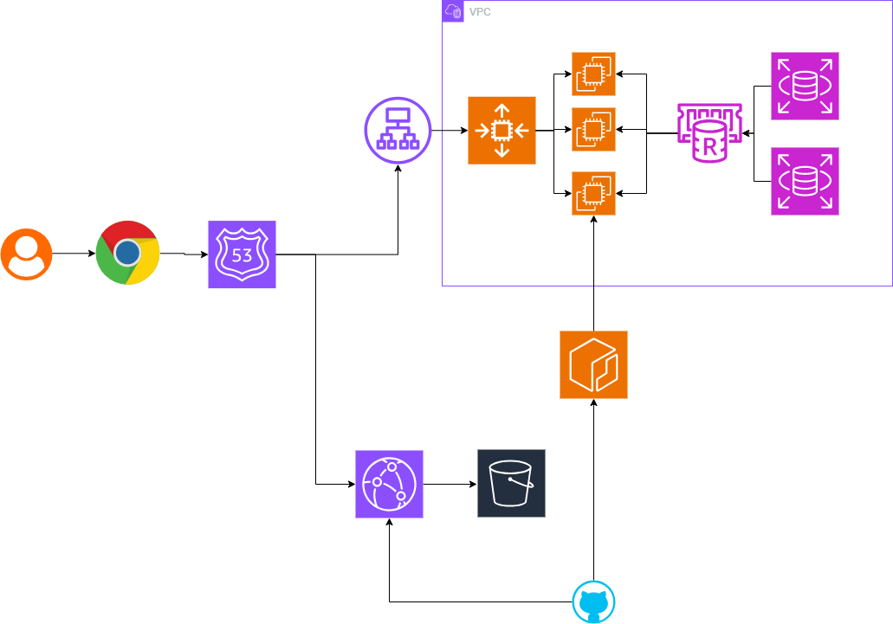

# LifeGuardian 

<!--  -->


## 👥 팀원 소개

<table style="width:100%; text-align:center;">
  <thead>
    <tr>
      <th>윤준상</th>
      <th>김다솜</th>
      <th>박하얀</th>
      <th>박재하</th>
    </tr>
  </thead>
  <tbody>
    <tr>
      <td>
        <br>
        🔗 <a href="https://github.com/wnstkd704">wnstkd704</a>
      </td>
      <td>
        <br>
        🔗 <a href="https://github.com/myangD">myangD</a>
      </td>
      <td>
        <br>
        🔗 <a href="https://github.com/P-HAYAN">P-HAYAN</a>
      </td>
      <td>
        <br>
        🔗 <a href="https://github.com/horolo1234">horolo1234</a>
      </td>
    </tr>
  </tbody>
</table>

<br>

## 📍 목차

1. [프로젝트 개요](#1-프로젝트-개요)
2. [배경 및 기획의도](#2-배경-및-기획의도)
3. [WBS](#3-WBS)
4. [기술 스택](#4-기술-스택)  
5. [시스템 아키텍처](#5-시스템-아키텍처)
6. [프로젝트 구조](#6-프로젝트-구조)
7. [요구사항 정의서](#7-요구사항-정의서)  
8. [테이블 정의서](#8-테이블-정의서)  
9. [ERD](#9-ERD)
10. [화면 및 기능 설계서](#10-화면-및-기능-설계서)
11. [API 명세서](#11-API-명세서)
12. [백엔드 테스트 보고서](#12-백엔드-테스트-보고서)
13. [프론트엔드 테스트 보고서](#13-프론트엔드-테스트-보고서)
14. [CI/CD 테스트 보고서](#14-CI/CD-테스트-보고서)
15. [회고](#15-회고)

<br>

## <a id="1-프로젝트-개요"></a> 1. 프로젝트 개요 

LifeGuardian은 보험사가 보유한 0~20세 자녀 가망고객 데이터를 활용하여, 보험 영업사원이 고객의 생애주기(건강·성장) 데이터를 기반으로 잠재 고객을 발굴하고, 고객별 보장 공백과 상담 타이밍을 분석하여 추천 보험 카테고리·상담 스크립트·우선 연락 대상을 제공하는 데이터 기반 보험 세일즈 큐레이션 플랫폼입니다.
단순 고객관리에 그치지 않고, 가망고객 배정 → 고객정보 수집 → 맞춤 보험 카테고리 추천 → 상담 스크립트 제공 → 계약 결과 관리 → 실패 고객 재공략 판단까지 지원합니다.
- 🗒️[기획서 (링크)](https://docs.google.com/document/d/1Kw0PjYCBg7ok991l6l2LZpR-QU-j9Hm67TgT6RC7wrI/edit?tab=t.0)

<br>

## <a id="2-배경-및-기획의도"></a> 2. 배경 및 기획의도

도입 배경: 가망고객 관리의 한계와 체계적 전환의 필요성 
현재 보험 영업 시장은 신규 고객 유치가 점차 어려워짐에 따라, 이미 확보한 가망고객 데이터를 실제 상담과 계약으로 전환하는 체계적인 관리 시스템의 중요성이 대두되고 있습니다. 하지만 기존의 영업 방식은 고객별 보장 공백이나 최적의 상담 타이밍, 자녀의 성장 단계, 과거 상담 이력 등이 데이터로 관리되지 않아 전적으로 영업사원 개인의 판단과 역량에 의존하는 한계가 있습니다. 이로 인해 귀중한 가망고객이 단순한 연락 대상에 머무르고, 상담 성공률이 높은 고객이나 실패 고객에 대한 재공략 기회를 번번이 놓치는 비효율이 발생하고 있습니다.

<br>
기획 의도: 자녀 보험을 매개로 한 가족 통합 세일즈 기회 창출 
본 프로젝트는 이러한 한계를 극복하기 위해 '0~20세 자녀를 둔 가망고객'의 특성에 주목했습니다. 자녀 보험의 실질적인 의사결정권과 결제권은 전적으로 '부모'에게 있습니다. 따라서 자녀의 성장 단계와 객관적인 보장 필요성을 근거로 접근하면, 부모와의 자연스러운 상담 창구를 열 수 있습니다.
더 나아가 이 상담 기회를 '도어 오프너(Door-opener)'로 활용하여 부모의 연령 변화와 기존 보장 상태까지 함께 점검한다면, 단건의 자녀 보험 상담을 객단가가 높은 '가족 단위 통합 보험 리모델링' 기회로 자연스럽게 확장할 수 있습니다.
결과적으로 본 플랫폼은 잠들어 있는 가망고객 데이터를 기반으로 자녀 보험 상담의 적기를 시스템이 자동으로 포착하고, 이를 부모의 보장 점검까지 유기적으로 연결하여 가망고객을 '가족 단위 통합 우수 고객'으로 전환하는 세일즈 큐레이션 환경을 제공하고자 기획되었습니다.

<br>

## <a id="3-WBS"></a> 3. WBS

<details>
<summary><b>🗓️ WBS 링크 </b></summary>

- 🗓️ [WBS (링크)](https://docs.google.com/spreadsheets/d/1jCL1br1RoIoiYlqEJTS_a4W8B9hhZFSuSCLUUObTIzE/edit?gid=503263989#gid=503263989)

</details>
<br>

## <a id="4-기술-스택"></a> 4. 기술 스택

### FRONTEND


### BACKEND


### DATABASE


### DEPLOYMENT


### CI/CD


<br>

## <a id="5-시스템-아키텍처"></a> 5. 시스템 아키텍처

<details>
<summary><b>🧱 시스템 아키텍처 펼쳐보기</b></summary>

</br>

</details>
<br>


## <a id="6-프로젝트-구조"></a> 6. 프로젝트 구조

<details>
<summary><b>📁 폴더 구조 펼쳐보기</b></summary>

```text
LifeGuardianCICD/
├── .github/                       # GitHub 설정 및 CI/CD 워크플로우
│   ├── ISSUE_TEMPLATE/            # 이슈 작성 템플릿
│   ├── workflows/                 # CI/CD 배포 자동화 스크립트 (.yml)
│   │   ├── ai-deploy.yml          # AI 추천 서비스 배포 자동화
│   │   ├── backend-deploy.yml     # 백엔드 서비스 배포 자동화
│   │   └── frontend-deploy.yml    # 프론트엔드 서비스 배포 자동화
│   ├── CODEOWNERS                 # 코드 관리자 지정 파일
│   └── PULL_REQUEST_TEMPLATE.md   # Pull Request 기본 템플릿
├── ai/                            # FastAPI / Python 기반 AI 추천 서비스
│   ├── Dockerfile                 # AI 컨테이너 빌드 파일
│   ├── app.py                     # AI 서비스 메인 애플리케이션 파일
│   └── requirements.txt           # Python 의존성 라이브러리 목록
├── backend/                       # Spring Boot 기반 백엔드 애플리케이션
│   ├── .gitattributes             # Git 속성 설정 파일
│   ├── .gitignore                 # Git 제외 대상 설정 파일
│   ├── Dockerfile                 # 백엔드 컨테이너 빌드 파일
│   ├── lifeguaridan.iml           # IntelliJ 프로젝트 설정 파일
│   ├── mvnw                       # Maven Wrapper 실행 스크립트 (Unix)
│   ├── mvnw.cmd                   # Maven Wrapper 실행 스크립트 (Windows)
│   ├── pom.xml                    # Maven 의존성 및 프로젝트 빌드 구성
│   └── src/                       # 백엔드 소스코드 디렉터리
│       ├── main/
│       │   ├── java/com/caremate/lifeguardian/
│       │   │   ├── admin/         # 관리자 페이지 기능 패키지
│       │   │   ├── auth/          # 인증 및 권한 관리 패키지 (JWT 등)
│       │   │   ├── batch/         # 배치 작업 처리 패키지
│       │   │   ├── common/        # 공통 유틸리티 및 예외 처리 패키지
│       │   │   ├── config/        # Security, DB 등 환경설정 패키지
│       │   │   ├── dashboard/     # 대시보드 통계/데이터 패키지
│       │   │   ├── esg/           # ESG 평가 관리 패키지
│       │   │   ├── member/        # 회원 관리 패키지
│       │   │   ├── potential/     # 잠재고객 분석/예측 패키지
│       │   │   ├── recommendai/   # AI 추천 결과 관련 패키지
│       │   │   ├── recommendation/ # 추천 기능 서비스 패키지
│       │   │   ├── report/        # 리포트 생성 패키지
│       │   │   ├── reporthistory/ # 리포트 이력 관리 패키지
│       │   │   ├── sales/         # 영업/매출 관리 패키지
│       │   │   ├── scheduler/     # 스케줄러 등록 패키지
│       │   │   ├── script/        # 스크립트 로직 패키지
│       │   │   ├── userdetail/    # 사용자 상세 정보 패키지
│       │   │   ├── webform/       # 웹폼 신청 처리 패키지
│       │   │   └── LifeguardianApplication.java  # 스프링부트 실행 파일
│       │   └── resources/         # 백엔드 설정 및 리소스 파일
│       │       ├── fonts/         # 폰트 파일 저장소
│       │       ├── mapper/        # MyBatis SQL Mapper XML 디렉터리
│       │       ├── templates/     # 템플릿 파일 디렉터리
│       │       ├── application-local.yml  # 로컬 환경 설정 파일
│       │       ├── application-prod.yml   # 운영 환경 설정 파일
│       │       └── application.yml        # 공통 환경 설정 파일
│       └── test/                  # 백엔드 단위/통합 테스트 코드 디렉터리
├── frontend/                      # Vue 3 / Vite 기반 프론트엔드 애플리케이션
│   ├── .env.example               # 환경 변수 설정 예시 파일
│   ├── .gitignore                 # Git 제외 대상 설정 파일
│   ├── env.d.ts                   # TypeScript 환경 변수 정의 파일
│   ├── index.html                 # 싱글 페이지 애플리케이션(SPA) 진입 파일
│   ├── package.json               # 의존성 라이브러리 및 스크립트 설정 파일
│   ├── tsconfig.json              # TypeScript 설정 파일
│   ├── vite.config.ts             # Vite 빌드 및 플러그인 설정 파일
│   └── src/                       # 프론트엔드 소스코드 디렉터리
│       ├── api/                   # API 비동기 통신 정의 모듈
│       ├── assets/                # 이미지, 아이콘, 폰트 등 정적 리소스
│       ├── components/            # 재사용 가능한 UI 컴포넌트
│       ├── constants/             # 프로젝트 내 상수 정의 파일
│       ├── pages/                 # 라우터와 매핑되는 뷰 페이지 컴포넌트
│       ├── router/                # 라우팅 설정 파일 (index.ts)
│       ├── stores/                # Pinia 전역 상태 관리 저장소 (auth.ts 등)
│       ├── utils/                 # 공통 유틸리티 헬퍼 함수
│       ├── App.vue                # 최상위 루트 Vue 컴포넌트
│       └── main.ts                # 프론트엔드 실행 진입 파일
└── out/                           # 빌드 출력 디렉터리
    └── production/                # 프로덕션 빌드 결과물 경로
```
</details>
<br/><br/>


## <a id="7-요구사항-정의서"></a> 7. 요구사항 정의서

<details>
<summary><b>🗒️ 요구사항 정의서 링크</b></summary>

- 🗒️[요구사항 정의서 (링크)](https://docs.google.com/spreadsheets/d/1jCL1br1RoIoiYlqEJTS_a4W8B9hhZFSuSCLUUObTIzE/edit?gid=182532999#gid=182532999)
</details>
<br>


## <a id="8-테이블-정의서"></a> 8. 테이블 정의서

<details>
<summary><b>🗄️ 테이블 정의서</b></summary>
  
- 🗄️[테이블 정의서 (링크)](https://docs.google.com/spreadsheets/d/1jCL1br1RoIoiYlqEJTS_a4W8B9hhZFSuSCLUUObTIzE/edit?gid=738235602#gid=738235602)

</details>
<br>

## <a id="9-ERD"></a> 9. ERD

<details>
<summary><b>📌 ERD 구조도</b></summary>
  
- [📌 ERD 구조도 (링크)](https://www.erdcloud.com/d/JRyerDijNh2LSzcys)
  
</details>
<br>

## <a id="10-화면-및-기능-설계서"></a> 10. 화면 및 기능 설계서

<details>
<summary><b>📱 화면기능 설계서 링크</b></summary>
  
- [📱 화면기능 설계서 (링크)](https://www.figma.com/design/YsS0a4pXrSQ8iid6vSG3Uh/LifeGuardian?node-id=83-3204&t=dI86XlgA43Ko8vdL-1)

</details>
<br>

## <a id="11-API-명세서"></a> 11. API 명세서

<details>
<summary><b>📋 API 명세서 링크</b></summary>
  
- [📋 API 명세서 (링크)](https://app.notion.com/p/API-35d01e6e88718051b2dcc2ffb8329139)

</details>
<br>

## <a id="12-백엔드-테스트-보고서"></a> 12. 백엔드 테스트 보고서(스프레드 시트)

<details>
 <summary><b>🧾 백엔드 테스트</b></summary>

- [🧾 백엔드 테스트 결과서 (링크)](https://docs.google.com/spreadsheets/d/1jCL1br1RoIoiYlqEJTS_a4W8B9hhZFSuSCLUUObTIzE/edit?gid=827415517#gid=827415517)

</details>
<br>

## <a id="13-프론트엔드-테스트-보고서"></a> 13. 프론트엔드 테스트 보고서(스프레드 시트)

<details>
 <summary><b>🧾 프론트엔드 테스트</b></summary>

- [🧾 프론트엔드 테스트 결과서 (링크)](https://docs.google.com/spreadsheets/d/1jCL1br1RoIoiYlqEJTS_a4W8B9hhZFSuSCLUUObTIzE/edit?gid=1145191922#gid=1145191922)

</details>
<br>

## <a id="14-CI/CD-테스트-보고서"></a> 14. CI/CD 테스트 보고서

<details>
 <summary><b>🧾 CI/CD 테스트 계획서</b></summary>

- [🧾 CI/CD 테스트 계획서 (링크)](.github/cicd-plan.md)
</details>

<details>
 <summary><b>🧾 CI/CD 테스트 보고서</b></summary>

- [🧾 CI/CD 테스트 보고서 (링크)](.github/cicd-test-report.md)

</details>
<br>

## <a id="15-회고"></a> 15. 회고

|   이름   |     회고 내용     |
|-----------|-----------------|
|      윤준상      | 보험 영업 지원 플랫폼을 개발하며 보험 도메인과 추천 시스템 설계 과정을 깊이 이해할 수 있었습니다. 룰 엔진 기반 보험 추천 로직을 구현하며 질병 통계와 고객 문진 정보를 활용한 맞춤형 추천 과정을 경험했습니다. Redis 캐시를 적용하여 반복 조회 성능은 개선했지만, 최초 추천 생성 시에는 점수 계산과 담보 조합으로 인해 응답 대기 시간이 발생하는 한계도 확인했습니다. 이를 개선하기 위해 고객별 추천 결과를 미리 생성하는 Spring Batch 기반의 사전 생성 방식으로 확장하여 초기 응답 속도를 더욱 향상시키고 싶습니다.    |
|      김다솜      | spring Batch를 활용해 고객 졸업 처리와 정기 리포트 생성을 자동화하며 배치 처리 흐름을 이해했다. 생성한 PDF 리포트는 S3에 저장하고, 프론트에는 유효시간이 있는 Presigned URL을 제공해 안전하게 조회하도록 구현했다. 또한 EC2, RDS, S3, CloudFront와 IAM 역할·정책을 설정하며 AWS 배포 과정을 경험했다. 이를 통해 백엔드 개발은 API 구현뿐 아니라 배치, 파일 저장, 보안, 인프라 구성까지 함께 고려해야 한다는 점을 배웠다.|
|      박하얀      |  이번 LifeGuardian 프로젝트에서는 영업사원을 위한 잠재고객 관리와 대시보드 화면 구현, 웹폼 기능 및 대시보드 집계 로직 개선을 담당하였습니다. 프로젝트를 시작할 당시에는 보험 영업 도메인에 대한 이해가 부족했지만, 잠재고객 관리부터 상담, 계약 진행까지의 기능을 구현하며 실제 보험 영업 프로세스를 이해할 수 있었습니다. 또한, 웹폼 발송부터 회수, 상담 상태 변경까지 이어지는 업무 흐름을 구현하며 기능 간 데이터 연계와 프로세스가 유기적으로 연결되어 있다는 점을 체감할 수 있었습니다. 대시보드와 영업현황의 데이터가 서로 다르게 표시되는 문제를 분석하는 과정에서는 MyBatis SQL과 집계 로직을 수정하며 데이터 정합성과 비즈니스 로직의 중요성을 배울 수 있었습니다. 이번 프로젝트를 진행하면서 프론트엔드 개발뿐 아니라 백엔드와 데이터베이스까지 더 깊게 분석하며 문제를 해결하는 경험을 쌓을 수 있었으며, 도메인에 대한 이해를 바탕으로 사용자 요구사항과 비즈니스 로직을 함께 고려하는 것이 완성도 높은 서비스를 구현하는 데 중요하다는 점을 배울 수 있었습니다.    |
|      박재하      | 이번 LifeGuardian 프로젝트에서 관리자 기능 개발과 GitHub Actions 기반의 CI/CD를 구축하며 시스템 운영 안정성을 향상시킬 수 있었다. 처음 접해보는 보험 영업 도메인이었기에 업계의 프로세스와 복잡한 비즈니스 로직을 파악하는 데는 어려움이 있었다. 이를 조율하는 과정에서 요구사항을 완벽히 이해하기 위해서는 개발팀 간 소통이 중요하다는 것을 알 수 있었다. 지점장 대시보드 및 영업사원 이관 기능 등을 개발하고, AWS SSM과 ECR을 연동하여 안전한 배포 환경을 완성했다. 이번 프로젝트를 통해 복잡한 B2B 도메인을 안정성있게 다루고 무중단 자동화 환경을 구축해내는 경험을 할 수 있었다. |

<br>
